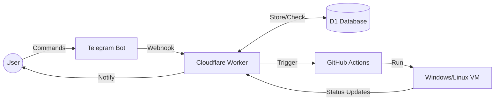

# ☁️ TryGitRDP - By Mega Digital
> **Deploy disposable Windows & Ubuntu RDP instances directly from Telegram using GitHub Actions.**

<div align="center">


[**Live Bot Demo**](https://t.me/TryGitRDP_Bot) | [**Report Bug**](https://github.com/mery6321/TryGitRDP/issues)

</div>

---

## 📖 About The Project

**TryGitRDP** is a serverless automation tool that bridges **Telegram** and **GitHub Actions**. It allows users to spawn temporary Remote Desktop Protocol (RDP) servers (Windows or Linux) entirely for free by leveraging GitHub's CI/CD infrastructure.

The backend is built on **Cloudflare Workers** (for speed and low cost) with a **D1 Database**, while the "brain" of the RDP is a smart Python script that communicates back to the user via Telegram.

### ✨ Key Features

* **📱 Telegram Native:** Full control via a user-friendly Telegram Bot (Reply Keyboards & Inline Buttons).
* **🖥️ Multi-OS Support:** Deploy **Windows Server 2022** or **Ubuntu (XFCE)**.
* **🔐 High Security:**
    * **Integrity Check:** Automatically blocks deployment if the user modifies the repo code (SHA Verification).
    * **Secret Masking:** Tokens and PINs are hidden in logs.
* **⚡ Fast & Scalable:** Powered by Cloudflare Edge Network.
* **👮 Admin Dashboard:** Real-time stats, Maintenance Mode, and Force Kill switches.
* **🛑 Smart Management:**
    * **Auto-Kill:** Terminate workflows instantly via GitHub API.
    * **Session Limits:** Restricts users to max 2 concurrent sessions.
    * **Language Support:** English 🇺🇸 & Indonesian 🇮🇩.

---

## 🏗️ Architecture



---

## 🚀 Installation & Deployment

This project consists of two parts: the **Cloudflare Worker (Backend)** and the **GitHub Repository (Runner)**.

### Prerequisites

* A Cloudflare Account.
* A GitHub Account.
* A Telegram Bot Token (from [@BotFather](https://t.me/BotFather)).
* Node.js & NPM installed (for Wrangler).

### Phase 1: Cloudflare Setup (The Brain)

1. **Clone this repo:**
```bash
git clone [https://github.com/yourusername/TryGitRDP-Public.git](https://github.com/yourusername/TryGitRDP-Public.git)
cd TryGitRDP-Public

```


2. **Install Dependencies:**
```bash
npm install

```


3. **Setup Database (D1):**
```bash
npx wrangler d1 create trygitrdp-core-db
# Copy the database_id and update wrangler.toml
npx wrangler d1 execute trygitrdp-core-db --remote --file=./schema.sql

```


4. **Set Secrets:**
Run the following commands to store your sensitive keys safely:
```bash
npx wrangler secret put BOT_TOKEN      # Your Telegram Bot Token
npx wrangler secret put CHANNEL_ID     # Your Channel ID for force subscribe
npx wrangler secret put GH_CLIENT_ID   # GitHub App Client ID
npx wrangler secret put GH_CLIENT_SECRET # GitHub App Client Secret
npx wrangler secret put ADMIN_ID       # Your Telegram ID

```


5. **Deploy:**
```bash
npx wrangler deploy

```


*Don't forget to set your Telegram Webhook to the worker URL!*

### Phase 2: GitHub Setup (The Runner)

1. Create a public repository (e.g., `TryGitRDP`).
2. Upload the contents of the `repo_files` folder to your GitHub root:
* `bot_master.py`
* `.github/workflows/RDP-Windows.yml`
* `.github/workflows/RDP-Ubuntu.yml`


3. **Important:** Do not modify the code inside `bot_master.py` or the workflows, or the Integrity Check will fail (unless you are the Admin).

---

## 🤖 Usage Guide

### 1. Initial Setup

Start the bot and link your GitHub account.

* `/start` - Start the bot.
* `/setup` - Choose **Method 1 (GitHub App)** for one-click login or **Method 2 (Personal Token)**.

### 2. Deploying RDP

* Select **🖥️ Deploy Windows** or **🐧 Deploy Ubuntu** from the menu.
* Wait for the "Initializing" message.
* Go to [remotedesktop.google.com/headless](https://remotedesktop.google.com/headless).
* Copy the command (PowerShell for Windows, Debian Linux for Ubuntu).
* Paste the command into the bot when asked.
* Set your 6-digit PIN.

### 3. Managing Session

Once active, the bot provides a control panel:

* **📊 Info:** See CPU/RAM usage and IP Location.
* **➕ Extend:** Add duration (Max 6 hours).
* **💀 Kill:** Terminate the session immediately.

---

## 👮 Admin Commands

Access the admin panel by typing `/admin` (Only works for the ID set in `ADMIN_ID`).

| Feature | Description |
| --- | --- |
| **Maintenance Mode** | Lock the bot for public users. |
| **Reset Sessions** | Force clear "Limit Reached" errors in the database. |
| **Clean DB** | Remove inactive users (>7 days). |
| **Stats** | See total users and active RDP count. |

---

## 🛡️ Security Mechanisms

* **Double SHA Check:** Before every deploy, the Worker fetches the hash of `bot_master.py` and the `.yml` workflow from the User's repo and compares it with the Admin's Master Repo. If they don't match, deployment is rejected.
* **Queue Cleaning:** The system automatically wipes the command queue before starting a new instance to prevent "Ghost Inputs" or error loops.

---

## ⚠️ Disclaimer

This project is for **educational and testing purposes only**.

* Do not use this for crypto mining (it violates GitHub TOS).
* Do not use this for illegal activities.
* The developer is not responsible for banned GitHub accounts.

---

## 🤝 Contributing

Contributions are welcome! Please fork the repository and submit a Pull Request.

1. Fork the Project
2. Create your Feature Branch (`git checkout -b feature/AmazingFeature`)
3. Commit your Changes (`git commit -m 'Add some AmazingFeature'`)
4. Push to the Branch (`git push origin feature/AmazingFeature`)
5. Open a Pull Request

---

<div align="center">

**Made with ❤️ by [mery6321**](https://www.google.com/search?q=https://github.com/mery6321)

</div>
